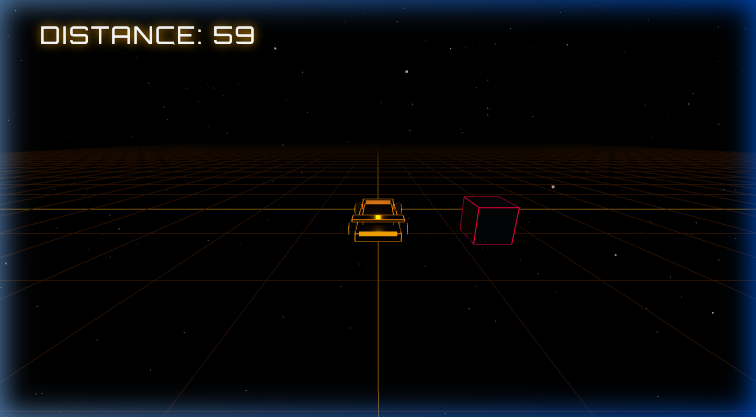
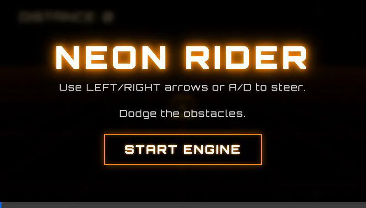

# Space Racer 🌌🏎️✨

A high-speed 3D endless runner built with **Three.js** and **Vite**, featuring a sleek futuristic car, a neon infinite grid, and dodge-or-crash gameplay.



## 🎮 Gameplay Preview
Here is the car in action!


## 🚀 Features
- **3D Vaporwave/Cyberpunk Aesthetic**: Deep space background with a glowing, hyperspeed infinite grid.
- **Custom Wedge-Shaped Car Model**: Fully modeled using primitive composition with neon edge highlights, glowing rims, and a rear thruster.
- **Endless Runner Mechanics**: Speed gradually increases as you travel further.
- **Responsive Controls**: Smooth banking and steering animations.
- **Neon UI**: Stylized HUD and menus utilizing modern glowing typography.

## 🕹️ How to Play

### Controls
*   **Steer Left**: `Left Arrow` or `A`
*   **Steer Right**: `Right Arrow` or `D`

### Objective
Dodge the incoming red neon obstacles! As your distance increases, the game will accelerate. Hit an obstacle, and it's **SYSTEM FAILURE**.

## 🛠️ Tech Stack & Tags
**Built with:** HTML5, Vanilla JavaScript, CSS3
**Engine:** [Three.js](https://threejs.org/)
**Bundler:** [Vite](https://vitejs.dev/)

**Tags:** `#threejs`, `#webgl`, `#javascript`, `#game-development`, `#indiegame`, `#cyberpunk`, `#vaporwave`, `#endless-runner`, `#browser-game`, `#vite`

## 💻 Local Setup Installation

To run this project locally, follow these steps:

1. **Clone the repository:**
   ```bash
   git clone https://github.com/KARIMDAVI/space-racer.git
   cd space-racer
   ```

2. **Install dependencies:**
   Make sure you have Node.js installed, then run:
   ```bash
   npm install
   ```
   *(This project relies on `three` and `vite`)*

3. **Start the development server:**
   ```bash
   npm run dev
   ```

4. **Play!**
   Open your browser to the local address provided by Vite (usually `http://localhost:5173`).

5. **Build for production:**
   ```bash
   npm run build
   ```

## 🤝 Contributing

Contributions, issues, and feature requests are welcome!

1. **Fork** this repository.
2. **Create** a new branch: `git checkout -b my-feature`
3. **Make** your changes and commit: `git commit -m "Add some feature"`
4. **Push** to your branch: `git push origin my-feature`
5. **Open** a Pull Request.

Please make sure your code follows the existing style and that the game still runs correctly before submitting a PR.
