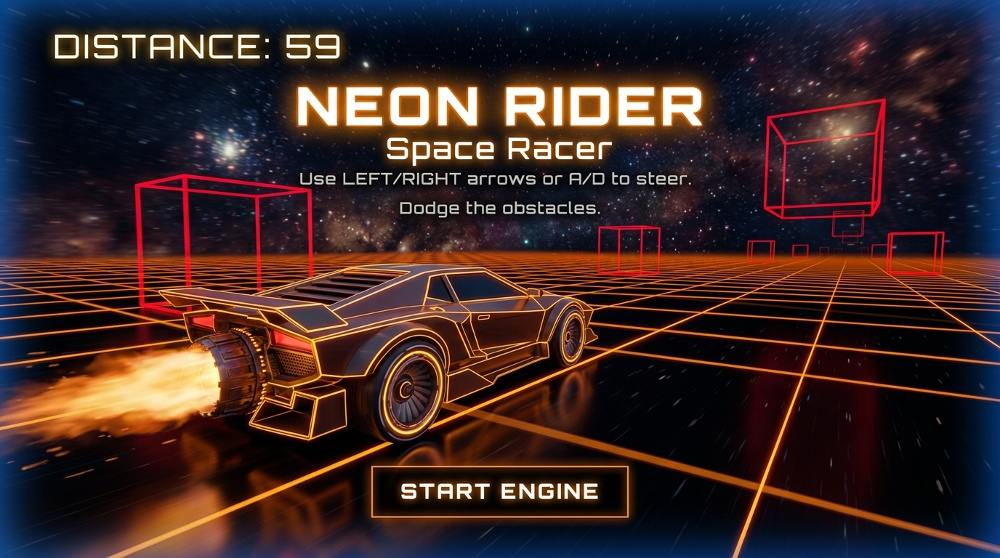
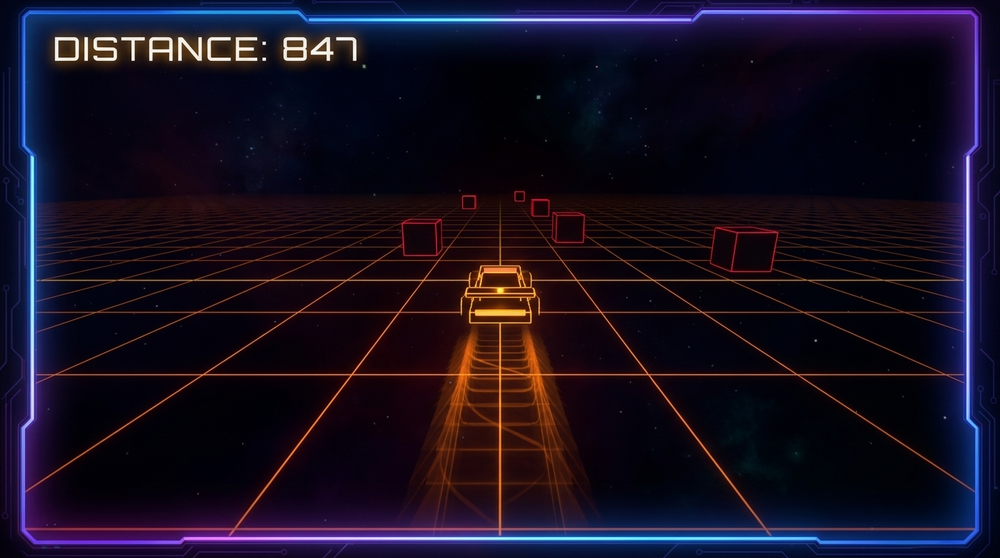
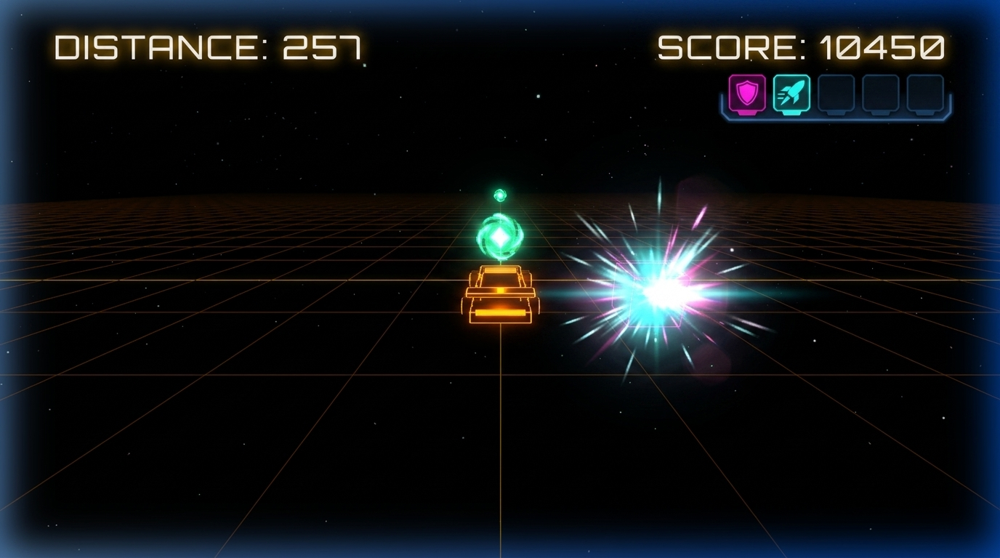
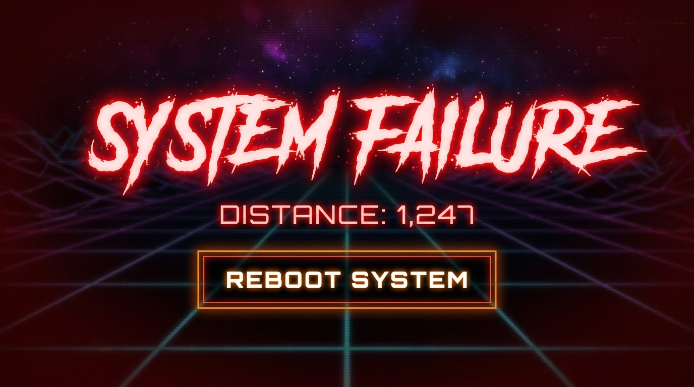
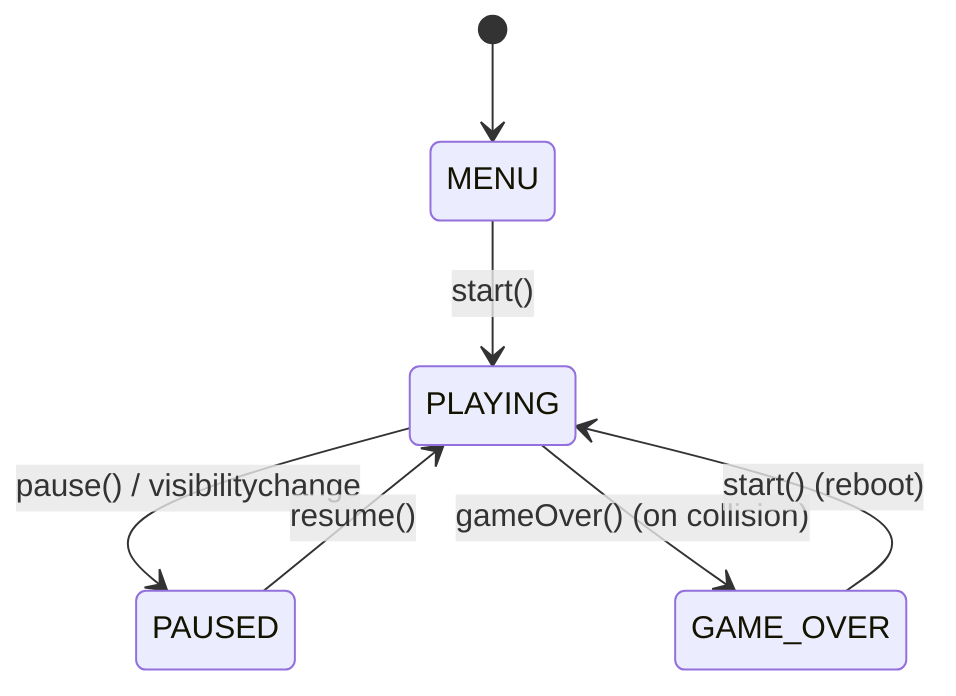

# Space Racer (Neon Rider) 🌌🏎️⚡

[](https://threejs.org/)
[](https://vitejs.dev/)
[](https://developer.mozilla.org/en-US/docs/Web/JavaScript)
[](https://developer.mozilla.org/en-US/docs/Web/API/Web_Audio_API)
[](./CONSTITUTION.md)
[](./LICENSE)

A high-performance, modular 3D cyber-endless runner engineered with **Three.js**, **Vanilla ES2020**, and **Vite**. Features custom procedural geometry, post-processing bloom pipelines, mathematically bounded asymptotic physics, zero-allocation object pools, pure Web Audio synthesis, and an audited solvable obstacle pattern library.

Governed under strict architectural principles defined in [`CONSTITUTION.md`](./CONSTITUTION.md) and [`BLUEPRINT.md`](./BLUEPRINT.md).

---



---

## 📑 Table of Contents

- [Executive Summary](#-executive-summary)
- [Visual Showcase](#-visual-showcase)
- [Core Gameplay & Mechanics](#-core-gameplay--mechanics)
  - [Progression & Asymptotic Speed Curve](#progression--asymptotic-speed-curve)
  - [Sectors & Biome Palettes](#sectors--biome-palettes)
  - [Hazard Ecosystem (8 Obstacle Types)](#hazard-ecosystem-8-obstacle-types)
  - [Authored Pattern Library & Solvability Guarantees](#authored-pattern-library--solvability-guarantees)
  - [Scoring & Near-Miss Graze Mechanics](#scoring--near-miss-graze-mechanics)
  - [Power-Up Arsenal](#power-up-arsenal)
- [Controls & Input Subsystem](#-controls--input-subsystem)
- [Technical Architecture](#-technical-architecture)
  - [Single Source of Truth & State Machine](#single-source-of-truth--state-machine)
  - [Zero-Allocation GPU Particle Engine](#zero-allocation-gpu-particle-engine)
  - [Rendering & Post-Processing Pipeline](#rendering--post-processing-pipeline)
  - [Procedural Road & Sub-Pixel Antialiasing](#procedural-road--sub-pixel-antialiasing)
  - [Pure Code-Synthesized Web Audio Engine](#pure-code-synthesized-web-audio-engine)
  - [DOM Layout Thrashing Elimination](#dom-layout-thrashing-elimination)
- [Project Structure & Module Ownership](#-project-structure--module-ownership)
- [Performance & Reliability Guarantees](#-performance--reliability-guarantees)
- [Local Development & Build](#-local-development--build)
- [Architecture Governance](#-architecture-governance)
- [License](#-license)

---

## 🌟 Executive Summary

Space Racer is built from the ground up without heavyweight external game engines. It is designed to prove that production-grade visual fidelity, complex procedural hazard generation, and 60 FPS performance can be achieved with minimal dependencies:

- **Zero External Audio Files Required**: Sound effects and engine hums are 100% synthesized in real time via the Web Audio API.
- **Zero Runtime Garbage Collection Spikes**: 51 hazard meshes, 19 collectible items, and particle buffers are pre-warmed and recycled using strict Object Pools.
- **Mathematically Proven Solvability**: Obstacle sequences are not random dice rolls; they are selected from an authored library verified against maximum lateral travel budgets.
- **Architectural Isolation**: Strict single-ownership domains (`GameManager`, `PlayerCar`, `Environment`, `ObstacleManager`, `RenderPipeline`, `AudioManager`, `HUD`, `InputHandler`).

---

## 📸 Visual Showcase

| High-Speed Navigation | Power-Up Collection & Magnetics |
| :---: | :---: |
|  |  |
| *Sector traversal with dynamic FOV scaling and neon bloom* | *Orb collection with sparkle bursts and active HUD chips* |

| Game Over / System Failure |
| :---: |
|  |
| *Crash time-dilation (0.3s slow-mo), mesh collapse, and delayed modal entrance* |

---

## 🎮 Core Gameplay & Mechanics

### Progression & Asymptotic Speed Curve

Rather than using an unbounded linear acceleration that eventually breaks pattern clearances, Space Racer implements an **asymptotic speed curve with a smoothed knee**:

$$\text{speed}(\text{score}) = v_0 + \frac{v_{\text{max}} - v_0}{\left(1 + \left(\frac{\text{score} \cdot k}{v_{\text{max}} - v_0}\right)^{-n}\right)^{1/n}}$$

- **Base Velocity ($v_0$):** `1.0` ($100$ world units/second).
- **Hard Speed Ceiling ($v_{\text{max}}$):** `4.8` ($480$ world units/second).
- **Initial Gain Slope ($k$):** `0.001` per score point.
- **Smooth Knee Exponent ($n$):** `10` (keeps the curve within $0.06$ of linear progression through Tier 5 while preventing impossible lateral gate traverses).
- **Hyperdrive Multiplier:** Boosts current velocity by **$+45\%$ ($1.45\times$)** during active burn, reaching up to $6.96$ world units/second while granting complete invulnerability.

### Sectors & Biome Palettes

As the score increases, the environment smoothly interpolates colors, fog density, and bloom intensity across a 3-second transition window:

| Sector | Score Range | Biome | Primary Accent | Base Color | Rail Color | Fog Density |
| :--- | :--- | :--- | :--- | :--- | :--- | :--- |
| **01 – 02** | $0 - 599$ | **Ember** | `#ff8800` (Amber) | `#060010` | `#ff9500` | `0.015` |
| **03 – 04** | $600 - 1999$ | **Coolant** | `#00d5ff` (Cyan) | `#00060f` | `#22ddff` | `0.016` |
| **05** | $2000 - 3199$ | **Violet** | `#ff33cc` (Magenta) | `#0a0014` | `#ff55d5` | `0.016` |
| **06+** | $3200+$ | **Critical** | `#ff2233` (Crimson) | `#120004` | `#ff4433` | `0.018` |

### Hazard Ecosystem (8 Obstacle Types)

All obstacles share a standardized $Y$-axis band (`SPAWN_Y = -0.5`), enabling optimized 2D analytic AABB collision testing:

1. **Block (`block`)**: Static $2 \times 2 \times 2$ solid neon cube hazard.
2. **Barricade (`barricade`)**: Multi-lane spanning containment wall forcing lateral lane changes.
3. **Gate (`gate`)**: Dual-panel barrier leaving exactly a 1-lane clearance opening.
4. **Slider (`slider`)**: Continuous sine-oscillating hazard sweeping across adjacent lanes ($1.4 - 2.6\text{ rad/s}$).
5. **Splitter (`splitter`)**: Centered dual-block unit that splits outward in antiphase upon car proximity.
6. **Pulse Gate (`pulse`)**: Alternating solid/ghost barrier anchored to arrival time, ensuring at least a $70\%$ open window on entry.
7. **Hunter Drone (`hunter`)**: Homing diamond drone tracking player $X$-coordinate with speed-dependent turn rates ($1.2 - 2.5\text{ units/s}$).
8. **Roller (`roller`)**: Rapidly advancing $1.3\times$ speed rotating cylinder spanning 2 lanes.

### Authored Pattern Library & Solvability Guarantees

Space Racer rejects unconstrained random placement. Hazards are spawned exclusively via **21 hand-authored patterns** plus a scheduled **Pacing Valley (Rest Pattern)**:

- **Lateral Movement Budget:** At Tier 5 ($420\text{ units/s}$), crossing 1 lane ($3\text{ units}$) takes $0.15\text{s}$ ($63\text{ units of } Z$). Every required lane shift is granted $\ge 90\text{ units of } Z$ ($\ge 1.4\text{ lanes of travel budget}$).
- **Exit-Lane Clear Tails:** Patterns ending near edge rails include $\ge 260\text{ units}$ of clear recovery tail to guarantee safe transitions into consecutive patterns.
- **Pacing Rhythm:** Rests (280 units of clear road) are scheduled dynamically every 5 to 7 patterns to create tension-and-relief pacing.
- **No Immediate Repeats:** Weighted pattern selection excludes the previously spawned pattern ID.

### Scoring & Near-Miss Graze Mechanics

- **Distance Accumulation:** $+0.1$ points per world unit traveled ($10\text{ pts/s}$ at base speed).
- **Near-Miss Graze Bonus:** $+15$ points awarded when passing within $1.2$ units of an active hazard boundary without colliding.
- **Score Orb Bonus:** $+25$ points for collecting a mint energy orb.
- **High Score Persistence:** Automatically recorded in `localStorage` under `spaceracer.v1`.

### Power-Up Arsenal

| Power-Up | Duration | Visual Aura | In-Game Effect |
| :--- | :---: | :--- | :--- |
| **Shield** | `12s` | Ice-Blue Geodesic Bubble (`#33ddff`) | Absorbs exactly 1 fatal collision; shatters into 70 particle shards on impact. |
| **Magnet** | `10s` | Magenta Forcefield (`#ff44aa`) | Attracts all mint score orbs within a 6-unit radius with exponential pull. |
| **Hyperdrive** | `4s` | Gold Exhaust Flare (`#ffdd22`) | $+45\%$ velocity surge, absolute invulnerability, $+11^\circ$ camera FOV warp, $+60\%$ bloom. |

---

## 🕹️ Controls & Input Subsystem

Space Racer features dedicated keyboard and multi-touch engines:

| Control Target | Desktop (Keyboard) | Mobile / Touchscreen |
| :--- | :--- | :--- |
| **Steer Left** | `ArrowLeft` or `A` | Hold left half of screen ($\le 50\%\text{ viewport width}$) |
| **Steer Right** | `ArrowRight` or `D` | Hold right half of screen ($> 50\%\text{ viewport width}$) |
| **Pause / Resume** | `Escape` | Tap pause indicator or UI button |

### Mobile Input Engineering
- **Pointer Capture:** Pointer events attach directly to the canvas using `setPointerCapture(pointerId)`.
- **Multi-Touch Support:** Independent pointer tracking ensures lifting one thumb never cancels an ongoing steer from the other.
- **Continuous Sliding:** Sliding a single thumb across the 50% screen midpoint smoothly flips steering direction without needing to lift and re-press.
- **Auto-Pause on Tab Concealment:** Utilizes the Page Visibility API (`visibilitychange`) to pause the run when switching tabs, preventing deaths on background tab reactivation.

---

## 🏗️ Technical Architecture

### Single Source of Truth & State Machine

Game state is managed strictly by `GameManager`, adhering to Principle II of the Constitution:


```mermaid
stateDiagram-v2
    [*] --> MENU
    MENU --> PLAYING: start()
    PLAYING --> PAUSED: pause() / visibilitychange
    PAUSED --> PLAYING: resume()
    PLAYING --> GAME_OVER: gameOver() (on collision)
    GAME_OVER --> PLAYING: start() (reboot)
```

No external module mutates `score`, `speed`, `powerups`, or `state` directly; all interactions route through explicit events on the zero-overhead `EventBus`.

### Zero-Allocation GPU Particle Engine

Particle effects are driven by a unified, high-performance `ParticleEmitter` backed by static `Float32Array` buffers and `THREE.Points`:

- **Pre-Allocated Memory:** Zero per-frame allocations (`new THREE.Vector3` or object creation).
- **Graveyard Parking:** Inactive particles are parked underground at $Y = -100,000$ to bypass vertex work.
- **Continuous & Burst Modes:** Handles both directional thruster streams (sub-frame fractional accumulation) and omnidirectional explosions (crash debris, shield burst, pickup sparkles).

### Rendering & Post-Processing Pipeline

The post-processing stack utilizes Three.js's `EffectComposer` with hardware-aware fallbacks:

1. **`RenderPass`**: Primary scene render pass.
2. **`SMAAPass`**: Subpixel Morphological Antialiasing (automatically enabled if 4x MSAA is unsupported by target hardware).
3. **`UnrealBloomPass`**: Downscaled to half internal resolution (`0.5x`) to preserve fill-rate while achieving rich vaporwave neon glow ($R=0.55$, $T=0.85$, $S=0.55 - 0.74$).
4. **`OutputPass`**: Applies `ACESFilmicToneMapping` and linear-to-sRGB color transform.
5. **Camera Shake Trauma:** Quadratic decay model ($\text{trauma}^2 \times 1.2$) for visceral collision feedback.

### Procedural Road & Sub-Pixel Antialiasing

The infinite neon grid highway is rendered using a custom GLSL `ShaderMaterial`:
- **Screen-Space Derivatives:** Computes `fwidth(uv)` to guarantee sharp $1\text{px}$ neon grid lines at any camera distance without texture mipmap blurring.
- **Precision Seamless Wrap:** Grid scroll is calculated via `uScroll = (uScroll + moveDist / CELL) % 1.0`, eliminating floating-point jitter over infinite runs.

### Pure Code-Synthesized Web Audio Engine

No `.wav` or `.mp3` dependencies for core SFX. All sounds are procedurally generated through the native Web Audio API:
- **Engine Voice:** Sawtooth oscillator + sub-octave sine through a resonant lowpass filter ($Q = 4$), gliding from $92\text{Hz}$ to $184\text{Hz}$ with speed.
- **Wind Rushing:** Noise buffer routed through a $1200\text{Hz}$ bandpass filter ($Q = 0.5$).
- **Collision Shockwave:** Lowpass-swept white noise burst ducking background music behind a $300\text{Hz}$ filter with exponential recovery.
- **Dynamic BGM Ingestion:** Build-time automated asset resolution via `import.meta.glob('../assets/audio/music.*')`.

### DOM Layout Thrashing Elimination

- **HUD Score Throttle:** Score readout DOM mutations are throttled to **10Hz** (`SCORE_WRITE_INTERVAL_MS = 100`) and gated on integer delta changes, eliminating 60 forced browser reflows/second.
- **Native Web Animations API:** Floating score bonus popups (`+15`, `+25`) use `Element.animate()`, running purely on the browser compositor thread.

---

## 📂 Project Structure & Module Ownership

Space Racer enforces strict domain ownership across its 24 source modules:

```
space-racer/
├── BLUEPRINT.md                 # 5-phase engineering roadmap & exit criteria
├── CONSTITUTION.md              # 7 Core Principles & architectural ownership map
├── LICENSE                      # MIT License
├── package.json                 # Dependency definitions (Three.js r171, Vite 6)
├── style.css                    # Responsive HUD, screen overlays & neon glowing typography
├── index.html                   # Canvas mounting point & HUD markup
├── vite.config.js               # ES2020 build config & relative base pathing
├── docs/
│   └── screenshots/             # 4K / HD visual assets for documentation
│       ├── hero_banner.jpg
│       ├── gameplay_action.jpg
│       ├── powerups.jpg
│       └── game_over.jpg
└── src/
    ├── main.js                  # Composition root & tick loop
    ├── core/
    │   ├── AssetManager.js       # THREE.LoadingManager & audio decoding
    │   ├── EventBus.js           # Decoupled pub/sub event bus
    │   ├── GameManager.js        # State machine, speed curve, score & tier owner
    │   ├── InputHandler.js       # Keyboard & canvas multi-touch engine
    │   └── PersistenceService.js # High score & mute localStorage persistence
    ├── entities/
    │   ├── CarModel.js           # Procedural wedge chassis, neon edges & underglow
    │   ├── PlayerCar.js          # Kinematic motion, wheel yaw, lean lerp & shatter
    │   └── ShieldShell.js        # Geodesic energy bubble & 70-shard burst
    ├── render/
    │   ├── ParticleEmitter.js    # Zero-allocation GPU particle pool (Float32Array)
    │   ├── RenderPipeline.js     # EffectComposer, MSAA, UnrealBloom & camera trauma
    │   └── gradientTexture.js    # Canvas2D radial & equirectangular reflection textures
    ├── audio/
    │   ├── AudioManager.js       # AudioContext lifecycle, pitch glide & music ducking
    │   └── voices.js             # Synthesis primitives (engine, wind, blips, noise)
    ├── ui/
    │   └── HUD.js                # 10Hz throttled DOM score writer & Web Animations
    └── world/
        ├── biomes.js             # 4 Biome color palettes & fog specifications
        ├── collectibleTypes.js   # Mint orbs & power-up crates object pools
        ├── CollectibleManager.js # Orb lines, magnet physics & sparkle bursts
        ├── obstacleTypes.js      # 8 hazard definitions, collision half-extents & pools
        ├── ObstacleManager.js    # Pattern scheduler, 2D AABB collision & graze detection
        ├── patterns.js           # 21 hand-authored solvable patterns & rest valleys
        └── Road.js               # GLSL shader road with fwidth() antialiased grid
```

---

## ⚡ Performance & Reliability Guarantees

| Subsystem | Architectural Design | Measured Performance |
| :--- | :--- | :--- |
| **Object Allocation** | Pre-warmed pools (51 obstacles, 19 collectibles) | 0 allocations / frame during active gameplay |
| **Collision Detection** | 2D Analytic AABB overlap test on $X/Z$ plane | $< 0.05\text{ms}$ CPU execution per frame |
| **DOM Synchronization** | 10Hz throttle on text writes; CSS transitions for overlays | Zero layout thrashing / zero forced reflows |
| **Post-Processing** | Halved-resolution bloom buffer ($0.5\times$ scale) | Constant 60 FPS on integrated mobile GPUs |
| **Time Dilation** | Frame delta clamp ($\le 1/30\text{s}$) | Complete tunneling prevention on tab return |

---

## 🚀 Local Development & Build

### Prerequisites
- **Node.js**: `v18.0.0` or higher
- **npm**: `v9.0.0` or higher

### Installation & Execution

1. **Clone the repository:**
   ```bash
   git clone https://github.com/KARIMDAVI/space-racer.git
   cd space-racer
   ```

2. **Install dependencies:**
   ```bash
   npm install
   ```

3. **Start the local development server:**
   ```bash
   npm run dev
   ```
   Open your browser to `http://localhost:5173`.

4. **Compile production build:**
   ```bash
   npm run build
   ```
   Outputs minified assets to `dist/`.

5. **Preview production build locally:**
   ```bash
   npm run preview
   ```

---

## 📜 Architecture Governance

This project is maintained under strict governance outlined in [`CONSTITUTION.md`](./CONSTITUTION.md):
- **Principle I (Modular Ownership)**: Each subsystem owns exactly one domain and communicates solely through the `EventBus` or explicit constructor contracts.
- **Principle II (Single Source of Truth)**: `GameManager` is the sole writer of game state and derived runtime metrics.
- **Principle III (Performance First)**: 60 FPS mobile budget is mandatory; no per-frame GC allocations permitted.
- **Principle IV (Native-First)**: Native browser capabilities (Canvas2D, Web Audio, Web Animations) are prioritized over third-party npm packages.
- **Principle V (Complete, Surgical Changes)**: Codebase maintains zero TODO placeholders or unfinished stubs.

---

## 📄 License

This project is licensed under the **MIT License** — see the [`LICENSE`](./LICENSE) file for complete details.

Copyright (c) 2026 **K!MO**
